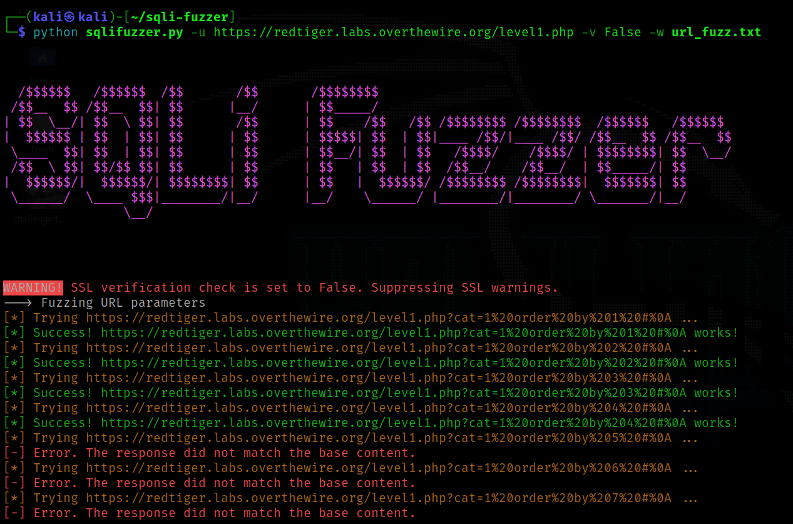

<h1 align="center">SQLi Fuzzer</h1>

<p align="center">
  <a href="#summary">Summary</a> •
  <a href="#requirements">Requirements</a> •
  <a href="#installation">Installation</a> •
  <a href="#usage">Usage</a> •
  <a href="#to-do">To Do</a> •
  <a href="#license">License</a>
</p>

</img>

## Summary

SQLi Fuzzer is a tool made for personal use. This tool fuzzes for URL or input parameters vulnerable to SQL Injections. The file `url_fuzz.txt` currently contains basic `ORDER BY` SQL queries passed in URL parameter. The default wordlist includes SQL queries in plaintext, url encoding and hex encoding.

**Warning: The tool is currently under development. I cannot gurantee successful utilisation.**

## Requirements
- Python 3.xx

## Installation
A few Python libraries are required for successfully usage. These libraries can be downloaded with the `requirements.txt` file.
```bash
# Clone this repository
$ git clone https://github.com/sapphicart/sqli-fuzzer.git

# Change directories
$ cd sqli-fuzzer

# Install required dependencies
pip install -r requirements.txt
```

## Usage 
Use the `--help` switch to read the `OPTIONS` available.
```bash
$ python sqlifuzzer.py --help
Usage: sqlifuzzer.py [OPTIONS]

Options:
  -u, --url TEXT        The URL to fuzz
  -v, --verify BOOLEAN  SSL certificate verification. Default True
  -w, --wordlist TEXT   /path/to/wordlist.txt
  --help                Show this message and exit.
```
Example:
```bash
$ python sqlifuzzer.py -u https://redtiger.labs.overthewire.org/level1.php -v False -w url_fuzz.txt
```

## To Do
Upcoming features:
- Input parameters fuzzing
- HTTP Verbs (GET, POST, PUT) fuzzing
- Diverse wordlist

## License
Distributed under [MIT](LICENSE) License.